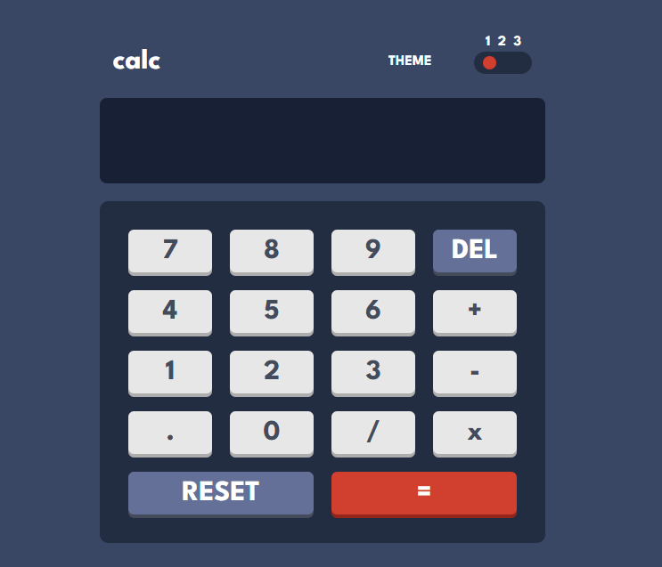
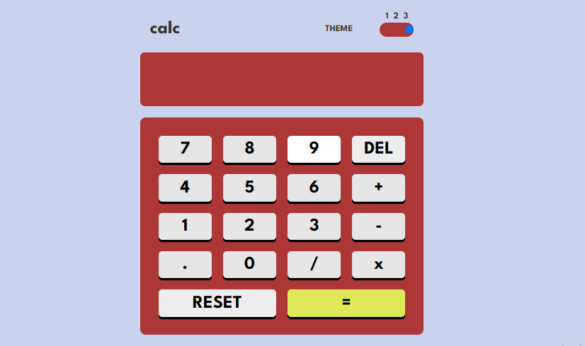
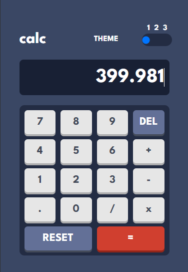

# Calculator 🧮

This project features a simple and responsive calculator built using HTML, CSS, JavaScript, and Tailwind CSS. The calculator supports basic operations (addition, subtraction, multiplication, and division) along with a clear/reset button. It comes with a theme that includes three color options and is fully mobile-friendly.

  

---

## Features
**Basic Operations ➕ ➖ ✖️ ➗:** Supports addition, subtraction, multiplication, and division.

**Clear Button (C) ❌:** Resets the calculator to its initial state.
**Mobile-Friendly 📱:** Optimized for mobile use with a responsive design.
**Three Themes 🎨:** Choose from three color themes for a personalized experience.

## Tech Stack 💻
- HTML 
- CSS 
- Tailwind CSS 
- JavaScript 

<!-- ### 🎨 Theme # 01

### 🎨 Theme # 02

### 🎨 Theme # 03
 -->

<!-- ### 🎨 Mobile Version

  

 -->

##  Demo 🎥
You can find a working demo [HERE](https://simple-calculaor.netlify.app/)

# Thanks for Checking Out My Work

Feedback is always welcome, and I’m excited to improve. 
[Let’s connect](https://linktr.ee/aamna_ansari)

 Crafted by <b>AaMna AnSari

