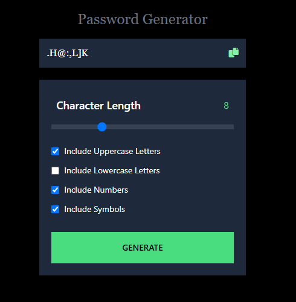

# Custom Password Generator

The custom password generator is a React.js app for producing random and strong passwords for use daily.

# Password Generator Functionalities

- 🔒 Generate a password between 1 and 30 characters
- ❌ Forces the use that at least 1 filter
- 🔤 Use lowercase, uppercase, symbols, and numbers in your password
- 🎨 Visual security indicator
- 📱 Mobile friendly
- 📋 Copy to clipboard

# Tech Stack
- ⚛️ React.js
- 🖌️ Tailwind CSS

## Demo

You can find a working demo [HERE](https://passmategenerator.netlify.app/)

📌Feedback is always welcome, and I’m excited to improve. 
[Let’s connect](https://linktr.ee/aamna_ansari)

Crafted by <b> AaMna AnSari  
