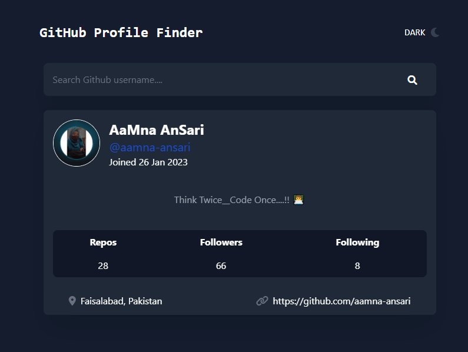

<h1 align="center">
       Github Profile Finder 🧐
</h1>

  
   

<h3 align="center">
          Live Project : https://finderprofile.netlify.app/
</h3>
 

<!-- ## Tech Stack :     -->

## Overview 🔨

The GitHub Profile Finder is a sleek and interactive web app that allows users to search for and explore GitHub profiles. It fetches data directly from the GitHub API to display user details such as their name, username, bio, repositories, followers, and location. The application is designed with accessibility in mind, offering a responsive layout and a light/dark mode toggle for an enhanced user experience.

## GitHub Profile Finder Functionalities
- 🔍 Search Bar 
- 👤 User Info  (Name, Username, Join Date, Bio)
- 📊 Stats  (Repos, Followers, Following)
- 📍   Location 
- 🔗 Website Link 
- 🌞 Theme Toggle 

## Tech Stack

- **Frontend:** HTML,CSS,React Js, JavaScript, Tailwind CSS 
- **Version Control:** Git and GitHub
- **Hosting:** Netlify
- **Code Editor and tools**: VS Code

## Demo 🎥 

  

## Developer 👩‍💻 
<table>
<td>

  

</td>
</tr>
</table>
